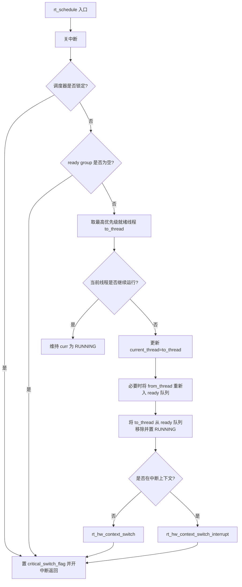

# RT-Thread 内核实验记录（QEMU）

> 说明：题目写的是 `qemu-aquila`，但当前仓库中未包含该 BSP。本文基于已跑通的 `bsp/qemu-vexpress-a9` 完成，分析方法与内核主线一致。

## 1. 从上电到 `rtthread_startup()` 的流程图与初始化项

核心路径（`libcpu/arm/cortex-a/start_gcc.S`）：

```mermaid
flowchart TD
    A[QEMU 上电复位] --> B[_reset]
    B --> C[get_pvoff 计算物理/虚拟偏移]
    C --> D[init_cpu_mode 退出/切换 CPU 模式]
    D --> E[init_kernel_bss 清零 .bss]
    E --> F[init_cpu_stack_early 建立早期栈]
    F --> G[init_mmu_page_table_early]
    G --> H[写 TTBR/DACR/TTBCR]
    H --> I[无效化 TLB / ICache / BP]
    I --> J[开启 MMU + Cache]
    J --> K[master_core_startup]
    K --> L[rt_kmem_pvoff_set]
    L --> M[跳转 rtthread_startup()]
```

该阶段已完成的初始化操作：

- CPU 模式相关初始化（SVC/IRQ/FIQ/ABT/UND 栈环境）
- BSS 段清零
- 早期页表和 MMU 控制寄存器初始化
- TLB/Cache/分支预测器失效与重建
- MMU/Cache 打开，建立可运行的 C 环境
- 将 PV 偏移传递给内核内存模块

---

## 2. 单核运行时 `rt_schedule()` 流程图

代码位置：`src/scheduler_up.c`



重点：

- 优先级数值越小优先级越高（`__rt_ffs` 找 first set bit）
- 同优先级时考虑 `YIELD` 标志决定是否让出
- 上下文切换分“线程上下文”和“中断上下文”两条路径

---

## 3. 线程上下文切换详细步骤（结合 GDB）

关键文件：`libcpu/arm/cortex-a/context_gcc.S`

### 3.1 普通线程切换 `rt_hw_context_switch(from_sp, to_sp)`

1. 保存现场到当前线程栈：
   - 压栈 `lr`、`r0-r12`、`cpsr`
   - 若启用 FPU / SMART，再扩展保存对应上下文
2. `str sp, [from_sp]`：把当前线程栈顶写回 TCB
3. `ldr sp, [to_sp]`：加载目标线程栈顶
4. 跳转 `rt_hw_context_switch_exit` 恢复目标线程现场
5. 恢复 `spsr` 与通用寄存器，最后 `... , pc^` 返回目标线程继续执行

### 3.2 中断上下文切换 `rt_hw_context_switch_interrupt`

- 在 ISR 中不立即完整切换时，会先记录 `rt_interrupt_from_thread / to_thread` 与 flag
- 在中断退出阶段统一完成切换，避免 ISR 内重入问题

### 3.3 GDB 建议断点

- `rt_schedule`
- `rt_hw_context_switch`
- `rt_hw_context_switch_interrupt`
- `rt_hw_context_switch_exit`

常用命令：`si`、`ni`、`info registers`、`x/8i $pc`

---

## 4. `mem.c:rt_malloc()` 小内存算法分配过程（源码级）

入口：`rt_malloc`（包装）最终落到 `rt_smem_alloc`（`src/mem.c`）

分配流程：

1. 对请求大小 `size` 做对齐（`RT_ALIGN`），并保证不小于 `MIN_SIZE_ALIGNED`
2. 从 `lfree` 指向的最低空闲块开始线性扫描空闲链
3. 找到可用块后分两种：
   - **可切分**：拆成“已分配块 + 新空闲块（mem2）”
   - **近似/恰好匹配**：整块分配，不切分
4. 将块标记为 USED，更新 `used/max` 统计
5. 更新 `lfree` 到下一个空闲块
6. 返回用户地址（块头 `struct rt_small_mem_item` 之后）

释放时（`rt_smem_free`）通过 `plug_holes` 做前后合并，降低碎片。

---

## 5. 实验：两个线程对同一全局变量自加 100 次，结果一致

实现位置：`bsp/qemu-vexpress-a9/applications/main.c`

- 线程 `cnt1/cnt2` 各循环 100 次
- 用 `rt_mutex` 保护 `g_counter++`
- 用 `rt_sem` 等待两个线程结束

结果：

- 打印：`[counter] final=200 expect=200 -> PASS`

---

## 6. 实验：线程 A 每 500ms 发邮件给 B，B 立即回复

实现位置：`bsp/qemu-vexpress-a9/applications/main.c`

- 使用两个邮箱：
  - `g_mb_a2b`：A -> B
  - `g_mb_b2a`：B -> A（确认回包）
- A 每 500ms 发一条，随后阻塞等待 B 回包
- B 收到后立刻回复 `mail + 1000`

结果（摘录）：

- `A->B send 1`
- `B recv 1, reply now`
- `A<-B ack 1001`
- ...
- `ping-pong finished.`

---

## 7. 实验：软中断定期发消息，两个线程分别接收打印

实现位置：`bsp/qemu-vexpress-a9/applications/main.c`

- 软中断：`rt_timer_create(..., RT_TIMER_FLAG_SOFT_TIMER | RT_TIMER_FLAG_PERIODIC)`
- 软中断回调中周期发送递增消息到 `rt_mq`
- 两个消费者线程 `sc1/sc2` 共同等待同一消息队列

结果（摘录）：

- `[softirq] timer send msg=1 ret=0`
- `[softirq] sc2 recv msg=1`
- `[softirq] timer send msg=2 ret=0`
- `[softirq] sc1 recv msg=2`
- ...
- `[softirq] dispatch finished.`

---

## 8. 跑通记录

已在 QEMU 中编译运行验证：

1. `./scripts/build-qemu-vexpress-a9.sh`
2. `timeout 20s ./qemu-nographic.sh`

串口日志中可见 3 组实验均执行完成，并打印 `==== RT-Thread Lab Done ====`.
